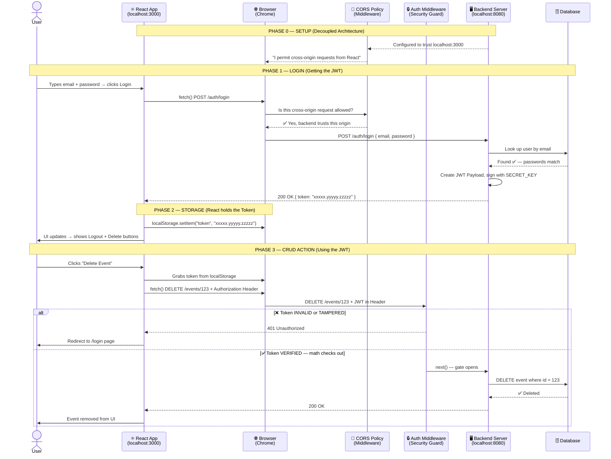

# Advanced React Authentication - Course Study Repo

**Course:** [React - The Complete Guide (incl. Next.js, Redux)](https://www.udemy.com/course/react-the-complete-guide-incl-redux/)
**Section:** Adding Authentication To React Apps
**Demo Project:** This repository contains the starting project and our ongoing progression through the React Router Authentication module.

> ### 🤖 Acknowledgments & Learning Approach
> This study journey is powered by a unique AI-assisted learning workflow:
> 
> **Google Antigravity Agent** — Acts as a Senior Instructor / Mentor, guiding deep conceptual discussions, explaining JavaScript internals, and fostering a Product Engineer mindset rather than just teaching syntax.

## 🎯 Goal
Deeply understand how Authentication works in complex React Single Page Applications (SPAs). This module will cover how we use tokens, loaders, and actions to handle complex, secure flows.

## 🧠 Core Concepts Learned

### 1. The Anatomy of Authentication in a React SPA
- **Authentication vs. Authorization:** Authentication proves *who* you are (checking your passport). Authorization proves *what* you can do (your VIP pass).
- **Stateless Web:** The internet has "amnesia." The backend server forgets who you are immediately after every request. Thus, the client must store proof of identity to maintain a session.
- **Why Authentication?** Essential for any application offering CRUD operations (Create, Read, Update, Delete) to maintain data privacy, attribution, and prevent malicious actions.

### 2. Coupled vs. Decoupled Architecture
- **Coupled (e.g., Next.js, traditional monolithic apps):** The backend serves HTML and handles cookies seamlessly. They often rely on Server-Side Sessions (the "VIP Clipboard").
- **Decoupled (e.g., React SPA + Node API):** Our current setup. Frontend and backend are separate. This introduces Cross-Origin Security (CORS) rules that block requests between the front and backend until explicitly enabled by the API.

### 3. Tokens and Middleware
- **JSON Web Token (JWT):** The standard "ID Card" for decoupled apps. It contains a Header, Payload (public user data), and a Signature (a mathematical hash guaranteed by a backend secret). The backend gives React the token, React stores it in `localStorage`, and sends it with future requests.
- **Middleware:** The "Security Guard." A backend function that intercepts a request, validates the JWT, and decides whether to kick the user out (401 Unauthorized) or let them pass (`next()`) to perform a secure action like deleting an event.

## 🗺️ The Complete Authentication Lifecycle

