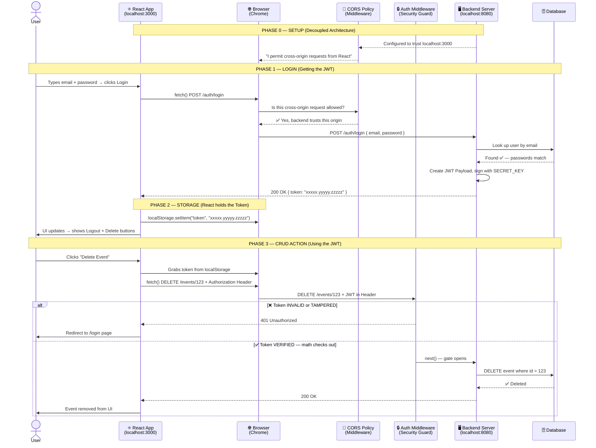

# Advanced React Authentication - Course Study Repo

**Course:** [React - The Complete Guide (incl. Next.js, Redux)](https://www.udemy.com/course/react-the-complete-guide-incl-redux/)
**Section:** Adding Authentication To React Apps
**Demo Project:** This repository contains the starting project and our ongoing progression through the React Router Authentication module.

> ### 🤖 Acknowledgments & Learning Approach
> This study journey is powered by a unique AI-assisted learning workflow:
> 
> **Google Antigravity Agent** — Acts as a Senior Instructor / Mentor, guiding deep conceptual discussions, explaining JavaScript internals, and fostering a Product Engineer mindset rather than just teaching syntax.

## 🎯 Goal
Deeply understand how Authentication works in complex React Single Page Applications (SPAs). This module will cover how we use tokens, loaders, and actions to handle complex, secure flows.

## 🧠 Core Concepts Learned

### 1. The Anatomy of Authentication in a React SPA
- **Authentication vs. Authorization:** Authentication proves *who* you are (checking your passport). Authorization proves *what* you can do (your VIP pass).
- **Stateless Web:** The internet has "amnesia." The backend server forgets who you are immediately after every request. Thus, the client must store proof of identity to maintain a session.
- **Why Authentication?** Essential for any application offering CRUD operations (Create, Read, Update, Delete) to maintain data privacy, attribution, and prevent malicious actions.

### 2. Coupled vs. Decoupled Architecture
- **Coupled (e.g., Next.js, traditional monolithic apps):** The backend serves HTML and handles cookies seamlessly. They often rely on Server-Side Sessions (the "VIP Clipboard").
- **Decoupled (e.g., React SPA + Node API):** Our current setup. Frontend and backend are separate. This introduces Cross-Origin Security (CORS) rules that block requests between the front and backend until explicitly enabled by the API.

### 3. Tokens and Middleware
- **JSON Web Token (JWT):** The standard "ID Card" for decoupled apps. It contains a Header, Payload (public user data), and a Signature (a mathematical hash guaranteed by a backend secret). The backend gives React the token, React stores it in `localStorage`, and sends it with future requests.
- **Middleware:** The "Security Guard." A backend function that intercepts a request, validates the JWT, and decides whether to kick the user out (401 Unauthorized) or let them pass (`next()`) to perform a secure action like deleting an event.

## 🗺️ The Complete Authentication Lifecycle

### 4. React Router Authentication Architecture (Sprint Recap)
During this module, we implemented a robust, product-grade authentication flow using React Router v6.4+ features:

- **URL State over Local State:** We replaced `useState` with URL query parameters (`?mode=login`). This makes UI states bookmarkable, shareable, and integrated with the browser's Back button.
- **Action & Loader Philosophy:** 
  - **Actions (Mutations):** All data submissions (login, signup, deleting) go through route `action` functions.
  - **Loaders (Fetching):** We set a global `tokenLoader` with `id: 'root'`. All child components use `useRouteLoaderData('root')` to instantly know the user's auth status.
  - **Revalidation:** The hidden superpower of React Router. Whenever an `action` successfully executes (like Logging Out), React Router automatically triggers **Revalidation**, re-running the loaders to ensure the UI perfectly matches the new database/auth state.
- **Error Handling & Status Codes (The 400s vs 500s):**
  - **422 (Unprocessable)** and **401 (Unauthorized):** We `return` these responses in our actions so the UI can use `useActionData` to gracefully highlight invalid form inputs in red without breaking the page.
  - **500 (Server Error):** We `throw` these responses to violently rip the user to the generic global `<ErrorPage />` because the system critically failed.
  - **Network Errors:** Remember that if the internet dies completely, `fetch()` bypasses HTTP status codes entirely and throws a fatal JavaScript error that must be caught via `try/catch`.
- **Security Trade-offs:** We chose `localStorage` for our Decoupled API approach (which is vulnerable to XSS attacks if we write poor React code), knowing the alternative is `HttpOnly` Cookies (which protects against XSS but requires CSRF protection and coupled environments like Next.js).
- **Auto-Login UX:** Both the Signup and Login endpoints on the backend return the identical JWT structure, allowing us to instantly log the user in after they register without forcing them to re-type their credentials.

## 📋 User Stories

<strong>Epic 1: Authentication (Login & Signup)</strong>

#### US-1.1: User Signup
> **As a** Guest, **I want to** create a new account by providing my email and password, **so that** I can access protected features.

**Acceptance Criteria:**
- The signup form is accessible at `/auth?mode=signup`.
- The form collects `email` and `password` fields using the HTML `name` attribute.
- On successful signup, a JWT Token is stored in `localStorage` and user is redirected to Home (`/`).
- If input is invalid, a `422` validation error is displayed inline on the form without crashing.
- If the server crashes, a global Error Page with `500` status is shown.

#### US-1.2: User Login
> **As a** Guest, **I want to** log in with my existing email and password, **so that** I can prove my identity and access protected actions.

**Acceptance Criteria:**
- The login form is accessible at `/auth?mode=login`.
- On successful login, an identical JWT Token is stored in `localStorage` and user is redirected to Home (`/`).
- If credentials are wrong, a `401` Unauthorized error is displayed inline on the form.
- If the server crashes, a global Error Page with `500` status is shown.

#### US-1.3: Toggle Between Login & Signup
> **As a** Guest, **I want to** switch between "Login" and "Create new user" modes on the same page, **so that** I don't have to navigate to a different URL.

**Acceptance Criteria:**
- A `<Link>` toggles the URL query parameter between `?mode=login` and `?mode=signup`.
- The form title dynamically changes based on the active mode.
- The URL is bookmarkable and shareable (URL State, not `useState`).

<strong>Epic 2: Event Management (CRUD)</strong>

#### US-2.1: View All Events
> **As a** Guest or Authenticated User, **I want to** see a list of all available events, **so that** I can browse what's happening.

**Acceptance Criteria:**
- The events list is accessible at `/events`.
- Data is fetched via a `loader` function *before* the page renders (no `useEffect` pattern).
- No authentication is required to view events.

#### US-2.2: View Event Details
> **As a** Guest or Authenticated User, **I want to** click on an event to see its full details, **so that** I can learn more about it.

**Acceptance Criteria:**
- The detail page is accessible at `/events/:eventId`.
- Data is fetched using `defer` + `Await` + `Suspense` for parallel, non-blocking loading.
- If NOT logged in, the "Edit" and "Delete" buttons are hidden.
- If logged in, the "Edit" and "Delete" buttons are visible.

#### US-2.3: Create a New Event (Protected)
> **As an** Authenticated User, **I want to** create a new event by filling out a form, **so that** I can share it with others.

**Acceptance Criteria:**
- The creation form is accessible at `/events/new`.
- A `checkAuthLoader` runs before the page renders. If NOT logged in, redirect to `/auth`.
- JWT Token is attached to the `Authorization: Bearer <token>` header on the POST request.
- On success, redirect to `/events`. On `422` validation error, inline errors are displayed.

#### US-2.4: Edit an Existing Event (Protected)
> **As an** Authenticated User, **I want to** edit an existing event's details, **so that** I can keep the information up to date.

**Acceptance Criteria:**
- The edit form is accessible at `/events/:eventId/edit`.
- A `checkAuthLoader` blocks unauthenticated access.
- The form is pre-populated with existing data using `defaultValue`.
- The form reuses `EventForm` and sends a `PATCH` method instead of `POST`.

#### US-2.5: Delete an Event (Protected)
> **As an** Authenticated User, **I want to** delete an event after confirming my intention, **so that** I can remove outdated events.

**Acceptance Criteria:**
- Clicking "Delete" triggers a `window.confirm()` confirmation dialog.
- If confirmed, `useSubmit()` programmatically fires the `deleteEventAction`.
- JWT Token is attached to the `Authorization` header.
- On success, redirect to `/events` and the deleted event disappears via Revalidation.

<strong>Epic 3: Navigation & Conditional UI</strong>

#### US-3.1: Conditional Navigation (Logged Out)
> **As a** Guest, **I want to** see "Home", "Events", "Newsletter", and "Authentication" links, **so that** I can navigate or log in.

**Acceptance Criteria:**
- The "Authentication" link is visible.
- The "Logout" button is hidden.
- The "New Event" link in the Events sub-navigation is hidden.

#### US-3.2: Conditional Navigation (Logged In)
> **As an** Authenticated User, **I want to** see "Home", "Events", "Newsletter", and a "Logout" button, **so that** I know I'm logged in and can log out.

**Acceptance Criteria:**
- The "Logout" button is visible.
- The "Authentication" link is hidden.
- The "New Event" link in the Events sub-navigation is visible.

<strong>Epic 4: Session Management (Logout & Expiration)</strong>

#### US-4.1: Manual Logout
> **As an** Authenticated User, **I want to** click a "Logout" button, **so that** my session is terminated and my token is cleared.

**Acceptance Criteria:**
- Clicking "Logout" submits a `<Form method="post" action="/logout">`.
- The `logoutAction` removes the token and expiration from `localStorage`.
- Revalidation triggers, causing `tokenLoader` to return `null`, which instantly hides all protected UI elements.
- User is redirected to the Home page (`/`).

#### US-4.2: Automatic Logout on Token Expiration
> **As the** System, **I want to** automatically log the user out when their JWT Token expires (after 1 hour), **so that** stale sessions are terminated.

**Acceptance Criteria:**
- On login/signup, a frontend expiration timestamp is saved to `localStorage` (current time + 1 hour).
- `Root.js` runs a `useEffect` that calculates the remaining token duration.
- If the token is already expired (`"EXPIRED"`), it triggers logout immediately.
- If the token is still valid, a `setTimeout` is set for the remaining duration to trigger automatic logout.

#### US-4.3: Inverse Route Protection
> **As the** System, **I want to** prevent authenticated users from accessing the Login/Signup page, **so that** users are not confused by seeing a form they no longer need.

**Acceptance Criteria:**
- A `checkInverseAuthLoader` runs before the `/auth` page renders.
- If a valid token exists, the user is instantly redirected to Home (`/`).
- If no token exists, the Auth page renders normally.

<strong>Epic 5: Newsletter</strong>

#### US-5.1: Newsletter Signup
> **As a** Guest or Authenticated User, **I want to** sign up for a newsletter by entering my email in the navbar, **so that** I can receive updates without navigating away from my current page.

**Acceptance Criteria:**
- The newsletter form is embedded in `MainNavigation` using `fetcher.Form` (not a standard `<Form>`).
- Submitting it fires the `/newsletter` action without triggering a full page navigation.
- On success, a `window.alert()` displays "Signup successful!".
- The submit button shows "Submitting..." while the request is in progress.

<strong>Epic 6: Error Handling</strong>

#### US-6.1: Graceful Validation Errors
> **As the** System, **I want to** display form validation errors (422/401) inline on the form, **so that** the user can correct their input without losing their progress.

**Acceptance Criteria:**
- The action function `return`s the error response (does not `throw`).
- The component uses `useActionData()` to read the returned error.
- Errors are rendered as a `<ul>` list above the form fields.

#### US-6.2: Global Error Page for Fatal Failures
> **As the** System, **I want to** show a global Error Page when a 500 server error or 404 not found occurs, **so that** the user knows something critical went wrong.

**Acceptance Criteria:**
- The action/loader function `throw`s a `new Response(...)` with a `500` or `404` status.
- React Router catches it and renders the `errorElement: <ErrorPage />`.
- The Error Page uses `useRouteError()` to extract `error.status` and `error.data.message`.

